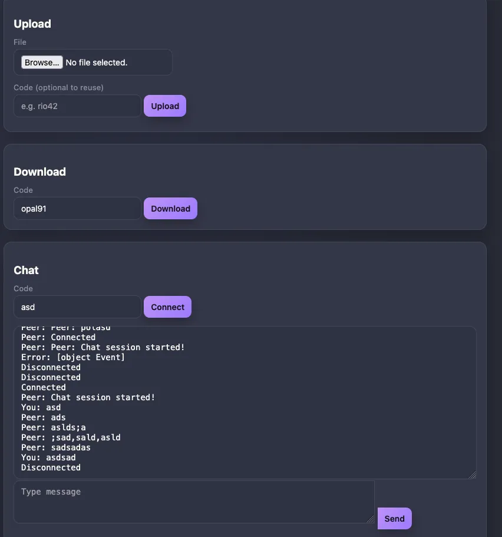

# Airsend (Web & Multi-User Chat Updates) 2026

## What’s New
- Web UI with Dracula-style dark theme (upload, download, chat).
- WebSocket chat now supports multiple users per code (broadcast room).
- Web chat sends with Enter (Shift+Enter for newline); shows “You/Peer” tags and auto-scrolls.
- Web download forces save-as (no inline preview).
- QUIC keepalive + 10 min idle timeout to avoid premature disconnects.

## Run (web + QUIC)
```bash
# or, with sudo if you want QUIC on 443:
sudo go run . -sw 0.0.0.0 3888 0.0.0.0 443
#or (I dont use this one >)
go run . -sw 0.0.0.0 3888 0.0.0.0 8443   # web on TCP 3888, QUIC on UDP 8443
```

## Ports
- Web UI: **TCP** on the first host/port (default 3888).
- QUIC (files & chat transport): **UDP** on the second host/port (default 443 or choose 8443).

## Web UI Usage
1. Open `http://<host>:3888`.
2. Upload: choose file, optional code; you get back a code.
3. Download: enter code, file downloads (forced attachment).
4. Chat: enter code, connect; type and hit Enter to send. Multiple browsers/CLI clients with the same code share a room.

## CLI Quick Reference
- Send file via server mic2:  
  `airsend -f file`  
  Example: `airsend -f file.pdf`
- Receive file:  
  `airsend -r <code> `
- Chat (client):  
  `airsend -m `  
  Example: `airsend -m room42 `

## Notes & Tips
- Ensure firewall opens **TCP 3888** for the web UI and **UDP** on your chosen QUIC port.
- Large chat messages: web log is taller, auto-scrolls; CLI chat now scrolls and prioritizes incoming messages.
- If binding to 443 fails, the process exits—use a high port (e.g., 8443) to keep both servers up.


## CLI Quick Reference
- Send file via LOCAL server:  
  `go run . -f <host> <port> <file>`  
  Example: `go run . -f  ServerIP 443 README.md `
- Receive file:  
  `go run . -r <code> <host> <port>`
  Example: `go run . -r wave21 10.0.4.180 443`
- Chat (client):  
  `go run . -m <code> <host> <port>`  
  Example: `go run . -m code 10.0.4.180 443`





The tutorial and usage steps are also available on my [https://docs.4rji.com/airsend](https://docs.4rji.com/airsend).


# AirSend

AirSend is a lightweight command-line tool developed to transfer files and exchange messages directly between machines with customized IP and port settings, overcoming limitations found in similar tools like Wormhole.

I created AirSend out of the necessity for flexibility that other tools like Wormhole lacked—particularly the ability to customize IP addresses and ports. AirSend addresses these gaps by supporting multiple file transfers, direct peer-to-peer connections, customizable ports, and the option to store files and messages on a relay server (C2).


# Update April 8

Finally fixed the chat.

Thanks to a goMN and the talk "Creating a TUI chat app" by Michael Duren (https://github.com/michael-duren/tui-chat.git), I was able to get the chat option working in AirSend. I copied the interface Michael created and implemented it, since previously messages were displayed more like in netcat.


An interactive window has been added when the chat is activated. Instead of waiting for a random code, users can now use a custom secret word to connect with another person using the same word — enabling private, direct chats.


For now, the chat supports only a client-client-server connection. I’ll work later on enabling group chats.


## Installation

Install the latest AirSend binary directly with Go (Go 1.20 or newer):

```bash
go install github.com/4rji/airsend@latest
```

This drops the `airsend` binary in your `GOBIN` (defaults to `$GOPATH/bin`).

If the proxy cache still serves an older module path, force a fresh download:

```bash
GOPROXY=direct GOSUMDB=off go install github.com/4rji/airsend@latest
```

Alternatively, from a local checkout you can run:

```bash
make install
```

Both approaches produce the same binary and make it easy to recreate the setup on another machine.


# Execution

With the new chat addition, run it like this:

```bash
go run .
```


### AirSend Default Configuration

| Variable               | Description                                             | Default Value            |
|------------------------|---------------------------------------------------------|--------------------------|
| `DEFAULT_SERVER_HOST`  | Default relay server host. *(Upcoming releases will allow specifying your own custom C2 domain.)* | `c2server.com`           |
| `DEFAULT_SERVER_PORT`  | Default port used for secure communications.            | `443`                    |
| `FILES_DIR`            | Directory for storing files in server (`-s`) mode.      | `/opt/4rji/airsend`      |


## Key Features

- Customize IP addresses and ports
- Send and receive multiple files
- Direct peer-to-peer connections
- Relay server support (C2)

## Usage

### Server Mode
Start a server to manage file transfers and message relays:
```bash
sudo airsend -s <host> <port>
```

### File Transfer
**Send Files:**
```bash
airsend -f <host> <port> <file1> <file2>
```

**Receive Files:**
```bash
airsend -r <host> <port> <code>
```


### Direct Transfer Mode

**Direct Receive:**
```bash
airsend -ds <listen-host> <port>
```


**Direct Send:**
```bash
airsend -d <target-host> [port] <file>
```


### Messaging
**Send Messages:**
```bash
coming soon```

**Receive Messages:**
```bash
coming soon
```

### Windows binary
```bash
GOOS=windows GOARCH=amd64 go build -o airsend.exe .
```


## Releases

Precompiled binaries for AMD and ARM architectures are available in the Releases section.
